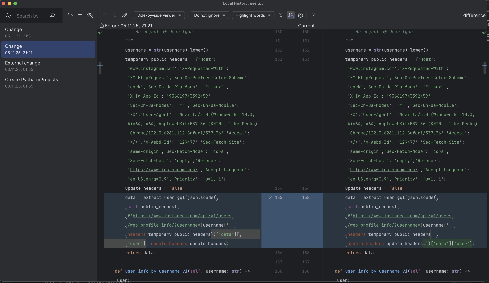

# This is the script to get the public data of a user on Instagram and the data of his/her followers.

## The biggest followers of a user will be collected and either auto followed ([instagrapi](https://github.com/subzeroid/instagrapi) is being used) or saved to a file.

### The script also do the sorting of user profiles by the number of followers of a given user:

    1. it gets the user info of each follower of a given user
    2. it gets the number of followers of each follower of a given user
    3. it sorts by the number of followers from (2) and outputs the top 10-20 followers (depending on the 'limit_top' variable).

If you need to collect the usernames first, use the following Chrome Extensions: [igfollow-follower-export](https://chromewebstore.google.com/detail/igfollow-follower-export) or 
[instagram-follower-collector](https://phantombuster.com/automations/instagram/7175/instagram-follower-collector) or alike.

### Prerequisites: https://github.com/subzeroid/instagrapi
`pip install instagrapi`

Read their [docs](https://subzeroid.github.io/instagrapi/usage-guide/user.html).
### Optional:
`pip install python-dotenv`

See & change USERNAME & PASSWORD at the top of [_helpers.py](_helpers.py).

### Change the values of the following variables in [main.py](main.py):
 - _limit_followers_count_,
 - _add_users_with_num_of_followers_, and 
 - _limit_top_

according to your needs.

## Known issues
#### - After some time of using the script, especially the auto follow function, you might get a message:
"feedback_required: We limit how often you can do certain things on Instagram, like following people, to protect our community. Let us know if you think we made a mistake."

In that case you'll have to wait for up to 24 hours to be able to follow users again.

#### - Some _update_headers_ error messages can appear while using 'extract_user_gql()' or 'user_info_by_username_gql()' functions.
Please look into this issue first if that's your case: https://github.com/subzeroid/instagrapi/issues/2266

I had to move _update_headers_ parameter in the user_info_by_username_gql() function in user.py to make it work:

Apparently this issue still hasn't been fixed throughout the whole codebase in the [2.2.1](https://github.com/subzeroid/instagrapi/releases/tag/2.2.1) release of [instagrapi](https://github.com/subzeroid/instagrapi).